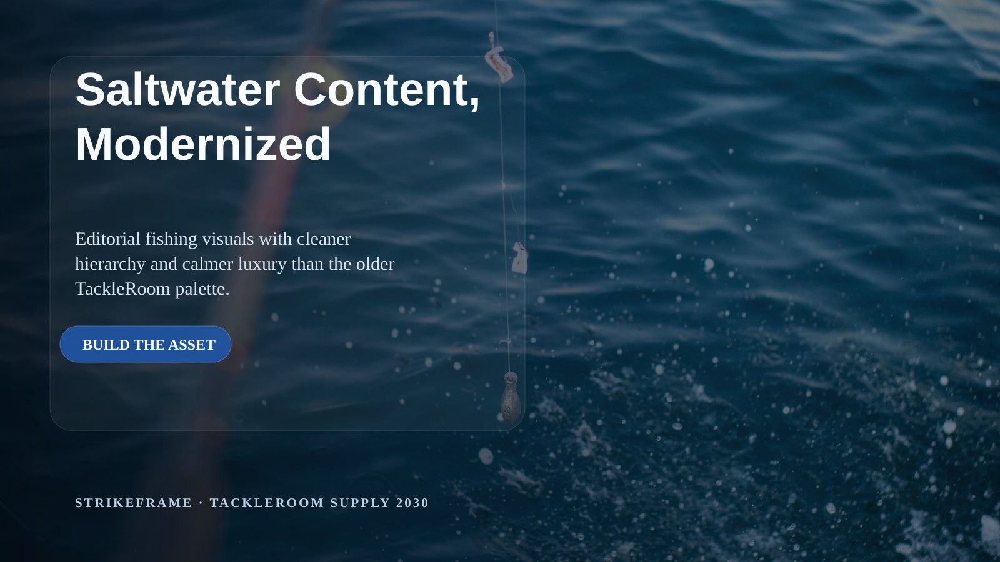
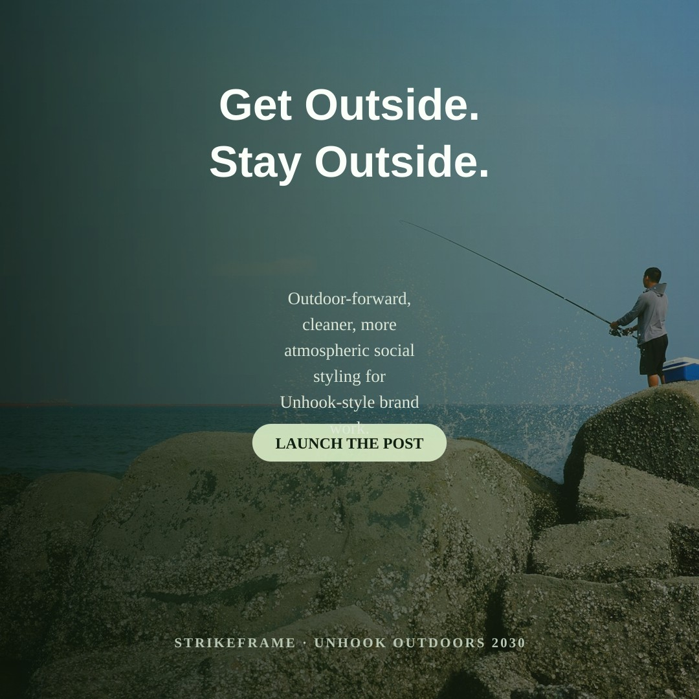

# StrikeFrame

Version: **v0.4.1**

Local renderer for banners, social graphics, and simple product composites.

## What it does
- renders marketing graphics locally
- uses JSON config files
- supports reusable size presets
- supports design frameworks, typography, button styles, layout personalities, and grouped CTA placement
- supports shape overlays, multiple text layers, batch rendering, and single-pass QA/QC review
- avoids GUI-tool dependency for simple asset generation

## Core idea
StrikeFrame should feel like an inspiring default design system, not a blank utility.

But the examples in this repo are **references, not the lane markers**.
If agents overfit to the examples, all output will look the same. That is failure, not consistency.

## Design philosophy
- Use examples to understand what is possible
- Build new layouts intentionally for the job at hand
- Do not blindly reuse the same layout, same photo, same left-text stack, or same CTA treatment
- Treat buttons and button labels as one grouped component
- Prefer brand-aware adaptation over rigid template reuse

## Layout personalities
- `editorial-left`
- `centered-hero`
- `split-card`

## Featured examples

### TackleRoomSupply 2030

### Contractor-AI 2030

### Unhook Outdoors 2030

### Editorial Premium

## QA/QC review layer
StrikeFrame runs a **single-pass review after file creation**.

It does **not** auto-rerender in a loop. It renders once, inspects once, writes a review file, and reports `pass`, `warn`, or `fail`.

Phase-1 vision review is now scaffolded as an optional second-stage critic against Popeye:
- `python3 scripts/vision_review.py <image> --channel x --persona tim-operator ...`
- `python3 scripts/qaqc.py <config> --vision on --channel x --persona tim-operator`
- `python3 scripts/qaqc.py <config> --vision required --channel x --persona tim-operator`

Review output:
- `<asset>.review.json`
- `<asset>.vision-review.json`

Checks include:
- headline/subhead/CTA fit inside the intended primary region
- panel padding
- spacing between headline/subhead/CTA/footer
- text-layer canvas overflow

## Review process
Do not trust the first render blindly.

Before calling an asset done, check:
- headline stays inside the intended composition area
- text does not overflow card/panel treatments
- CTA remains readable and visually distinct
- hierarchy reads fast on mobile
- colors feel modern, not muddy or dated
- image + typography mood match the brand/use case
- if the first render looks off, adjust the config and rerun once intentionally

## Run
- `npm install`
- `npm run render`
- `npm run render:square`
- `npm run render:linkedin`
- `npm run render:product`
- `npm run qaqc`

## Test and config hygiene
- `npm test` — config validation + smoke tests
- `npm run validate:configs` — parse all config JSON and flag missing repo-local refs
- `npm run test:smoke` — render self-contained fixtures and run QA/QC on the batch sample

Validation rules:
- missing repo-local assets = fail
- missing external asset refs (Dropbox/library paths) = warning only
- smoke tests fail only on render crashes or `reviewStatus/final_status = fail`

## Asset contract
- Sample configs are the self-contained test surface and should stay runnable on a clean checkout after `npm install`.
- Many production configs intentionally reference external asset libraries under Dropbox and other local paths; those are real workflow dependencies, not bundled repo fixtures.
- If an asset library moves, fix the config paths or the shared defaults instead of pretending the repo is fully portable.
- Repo-native code/docs/contracts belong here; generated calibration renders and scratch review batches belong in `/mnt/raid/Data/tmp/openclaw-builds/katya/...` until deliberately promoted.
- Dropbox is for verified final creative deliverables, not implementation debris.

More examples and experiments live in:
- `configs/frameworks/`
- `configs/styles/`
- `configs/proof/`
- `examples/`
- `skills/`
