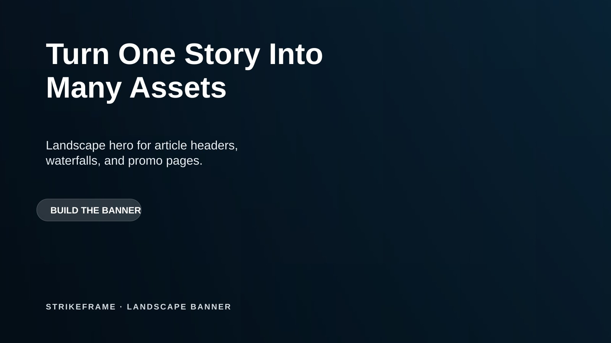
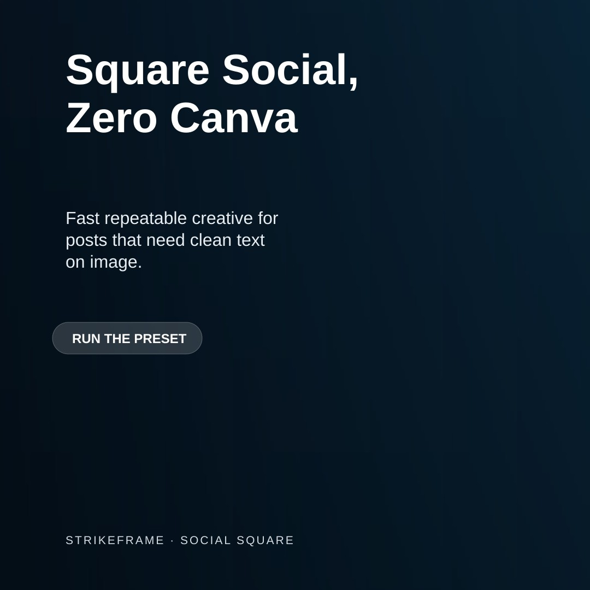
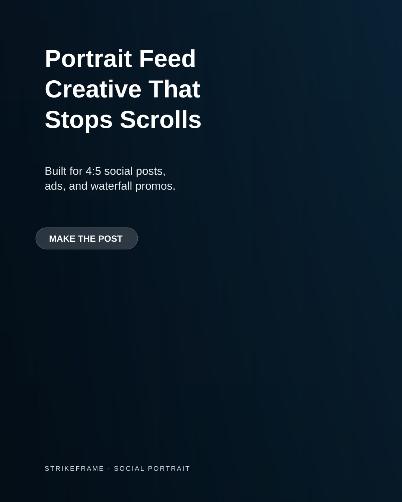
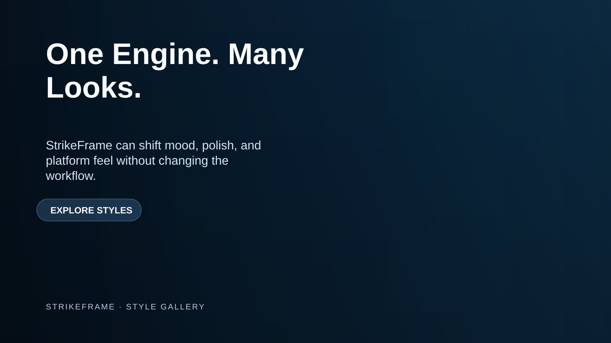
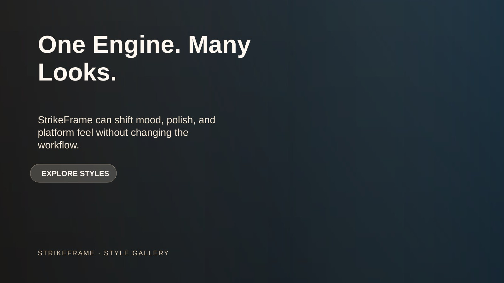
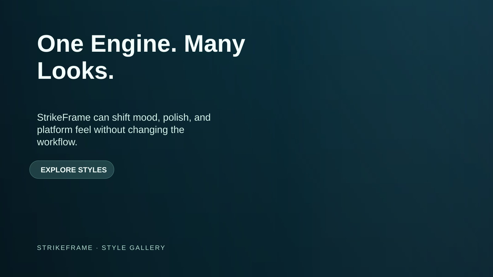
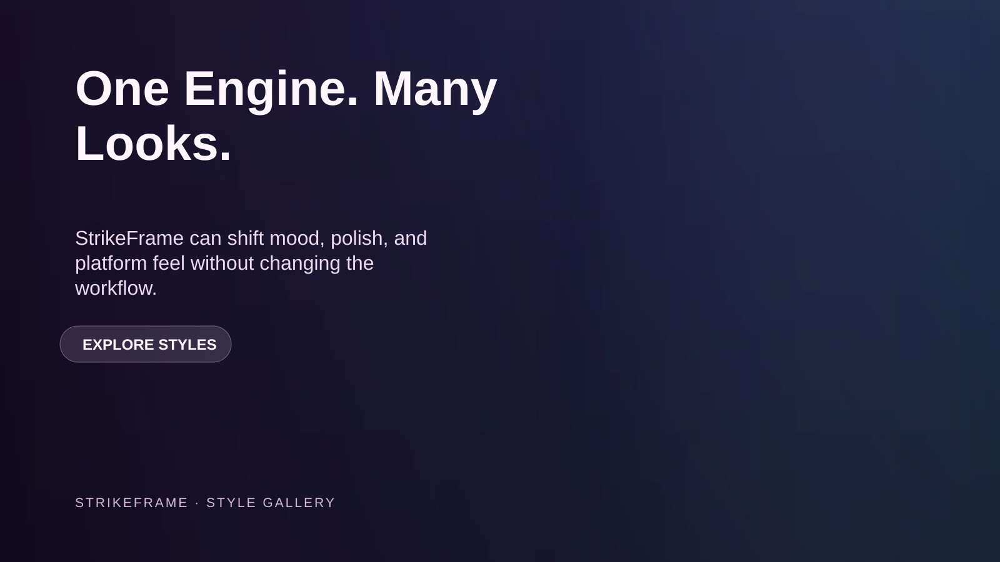

# StrikeFrame

Version: **v0.2.0**

Local renderer for banners, social graphics, and simple product composites.

## What it does
- renders marketing graphics locally
- uses JSON config files
- supports reusable size presets
- avoids GUI-tool dependency for simple asset generation

## Presets
- `landscape-banner`
- `social-square`
- `social-portrait`
- `linkedin-landscape`

## Templates
- `banner`
- `product-composite`

## Preset examples

### landscape-banner

### social-square

### social-portrait

### linkedin-landscape

## Style gallery

These show the same core layout with different modern palette directions.

### Midnight Signal

### Editorial Sand

### Aurora Mint

### Plum Luxe

## Run
- `npm install`
- `npm run generate:banner`
- `npm run generate:product`

## Generate each preset example
- `node scripts/render.js configs/sample-landscape-banner.json`
- `node scripts/render.js configs/sample-social-square.json`
- `node scripts/render.js configs/sample-social-portrait.json`
- `node scripts/render.js configs/sample-linkedin-landscape.json`

## Notes
- Works with a real background image if `backgroundPath` is provided in config
- Falls back to a generated gradient background if no source image is provided
