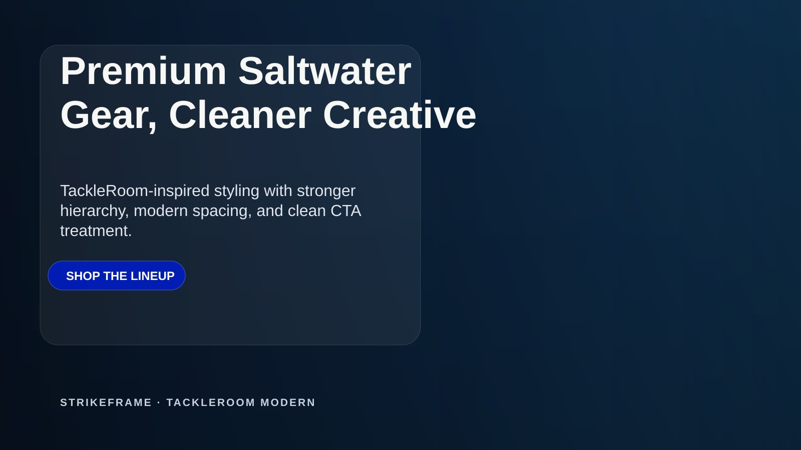
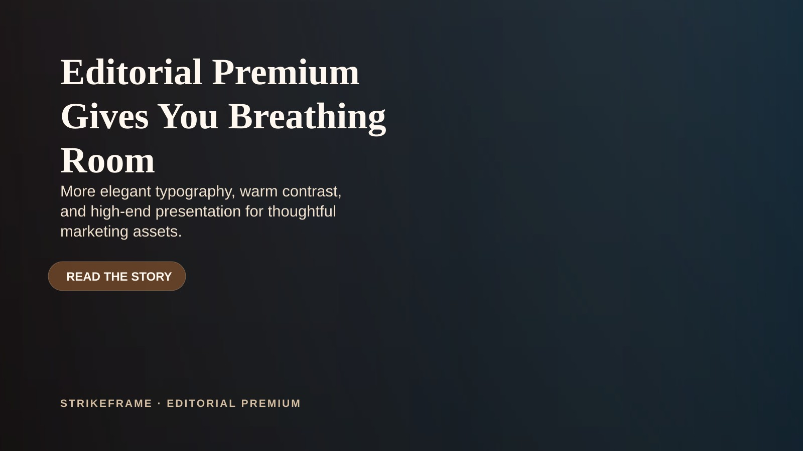
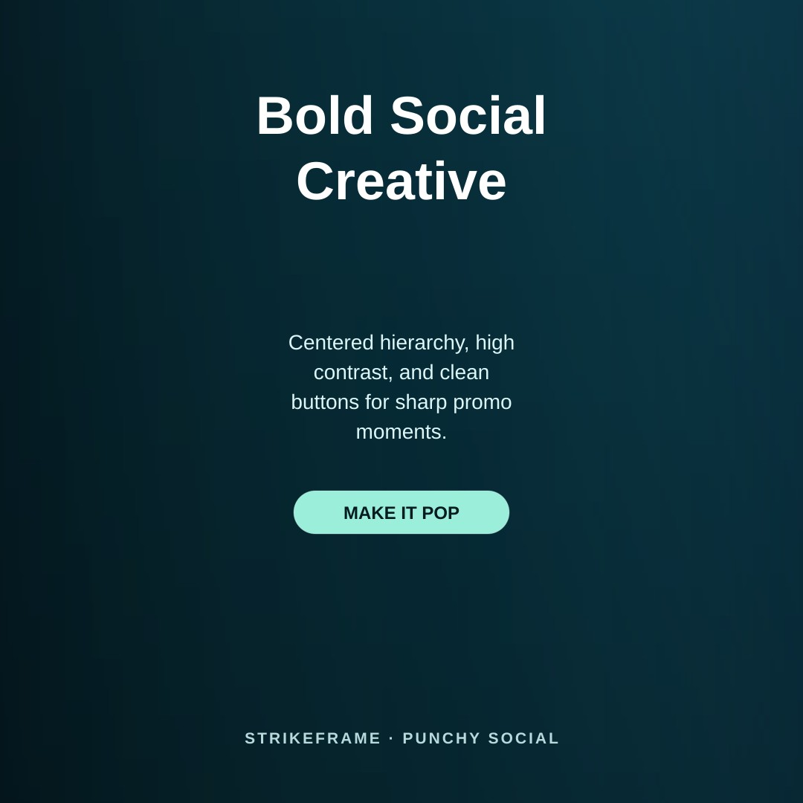
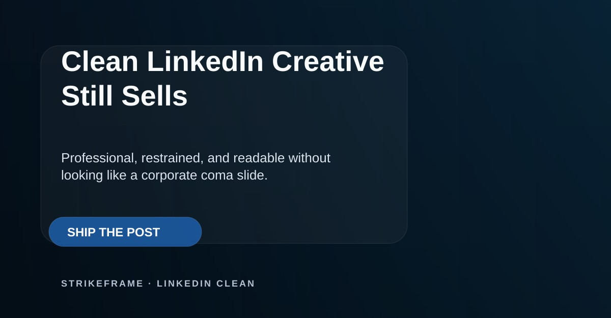

# StrikeFrame

Version: **v0.3.0**

Local renderer for banners, social graphics, and simple product composites.

## What it does
- renders marketing graphics locally
- uses JSON config files
- supports reusable size presets
- supports design frameworks, typography, button styles, and layout personalities
- avoids GUI-tool dependency for simple asset generation

## Core idea
StrikeFrame should feel like an **inspiring default design system**, not a blank utility.

The LLM should usually be able to make a strong first-pass decision on:
- font direction
- color palette
- CTA treatment
- spacing and hierarchy
- layout personality

without demanding a full marketing brief every time.

## Brand-aware default
If a brand/site already exists, take a quick look at it and match the spirit — then modernize it.

Example:
- `thetackleroom.com` uses a light neutral base, **Montserrat** headings, **Source Sans Pro** body copy, and a strong cobalt CTA.
- StrikeFrame can borrow that language, clean it up, and push it into a more modern campaign look without cloning the site 1:1.

## Presets
- `landscape-banner`
- `social-square`
- `social-portrait`
- `linkedin-landscape`

## Layout personalities
- `editorial-left` — classic marketing banner, strong left hierarchy
- `centered-hero` — centered high-impact promo/social layout
- `split-card` — modern panel/card treatment with more polish and readability

## Design frameworks
These are starting systems, not handcuffs.

### TackleRoom Modern
Inspired by The Tackle Room, but tightened up and modernized.

### Editorial Premium
Warmer, more refined, more story-driven.

### Punchy Social
Sharper, bolder, high-contrast social promo style.

### LinkedIn Clean
Restrained, credible, professional, but not dead.

## Preset examples

### landscape-banner

### social-square

### social-portrait

### linkedin-landscape

## Style gallery

These show the same core layout with different modern palette directions.

### Midnight Signal

### Editorial Sand

### Aurora Mint

### Plum Luxe

## Run
- `npm install`
- `npm run generate:banner`
- `npm run generate:product`

## Example configs
### Presets
- `node scripts/render.js configs/sample-landscape-banner.json`
- `node scripts/render.js configs/sample-social-square.json`
- `node scripts/render.js configs/sample-social-portrait.json`
- `node scripts/render.js configs/sample-linkedin-landscape.json`

### Frameworks
- `node scripts/render.js configs/frameworks/tackleroom-modern.json`
- `node scripts/render.js configs/frameworks/editorial-premium.json`
- `node scripts/render.js configs/frameworks/punchy-social.json`
- `node scripts/render.js configs/frameworks/linkedin-clean.json`

## Configurable systems
### Typography
- headline font family
- body font family
- font weights
- type scale

### Buttons
- fill color
- stroke color
- text color
- width/placement

### Layout
- alignment
- hierarchy spacing
- card/panel treatment
- centered vs left-led composition

### Theme
- gradient background
- overlay colors
- text colors
- badge/product plate styling

## Notes
- Works with a real background image if `backgroundPath` is provided in config
- Falls back to a generated gradient background if no source image is provided
- Current product-composite flow is still early; real product cutouts are the next important upgrade
